<div align="center">
  
</div>

<br/>

<div align="center">

```
╔══════════════════════════════════════════════════════════════════╗
║                    ◈  CONTROL PANEL  ◈                          ║
╠══════════════════════════════════════════════════════════════════╣
║  ▸ DESIGNATION   Ronaldo da Silva Mendonça Júnior               ║
║  ▸ STATION       Campos do Jordão · São Paulo · Brazil          ║
║  ▸ STATUS        ADS Student — Active Operator  ●               ║
║  ▸ INSTITUTE     Instituto Federal de São Paulo (IFSP)          ║
║  ▸ EDUCATION     IT Technician (concluded) · ADS (current)      ║
║  ▸ PASSIONS      Systems · Immersive UI · Automation · Design   ║
╚══════════════════════════════════════════════════════════════════╝
```

</div>

<div align="center">
  
</div>

<br/>

##  &nbsp;TECH ARSENAL

<div align="center">


</div>

<br/>

<div align="center">
  
</div>

<br/>

## ⚙ PROJECT FORGE

<div align="center">

| &nbsp; | Project | Description | Stack |
|:---:|---|---|---|
| 🍽 | **Restaurant Management System** | Full mechanical restaurant operation engine — orders, tables, inventory and billing | `C#` `SQL Server` `.NET` |
| 🛍 | **Clothing Store System** | Automated industrial warehouse — inventory, POS, freight calculation, order tracking | `C#` `SQL Server` `WinForms` |
| 🧾 | **POS Terminal** | Retro-futuristic Victorian terminal — fiscal printer simulation, transaction history | `C#` `SQL Server` |
| 🌐 | **E-Commerce Platform** | Three independent store systems — inventory, shipping, admin dashboard, responsive | `JavaScript` `Node.js` `PostgreSQL` |

</div>

<br/>

<div align="center">
  
</div>

<br/>

## ⚙ REACTOR CORE — GitHub Stats

<div align="center">


&nbsp;&nbsp;


</div>

<br/>

<div align="center">
  
</div>

<br/>

## 📡 NETWORK TERMINAL

<div align="center">

[](https://github.com/ronaldoribeirosm)
&nbsp;
[](https://www.linkedin.com/in/ronaldo-ribeiro-2256a43a8/)
&nbsp;
[](mailto:ronaldoribeirosm@gmail.com)

</div>

<br/>

<div align="center">
  
</div>

<br/>

<div align="center">

```
╔══════════════════════════════════════════════════════════════════╗
║      THE BRASS WORKSHOP  ◈  ALL SYSTEMS OPERATIONAL             ║
║      © Ronaldo da Silva Mendonça Júnior · Campos do Jordão      ║
╚══════════════════════════════════════════════════════════════════╝
```

</div>
