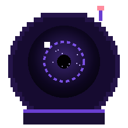

<div align="center">
  

[](https://git.io/typing-svg)

</div>

<table width="100%">
<tr>

<td width="30%" valign="top" align="center">



### Ronaldo Mendonça

`dev júnior` · `campos do jordão, br`

<br/>

📍 Campos do Jordão · SP<br/>
🎓 IFSP — ADS (cursando)<br/>
🛰️ Téc. em Informática ✔<br/>
✦ Status: `em órbita, aberto a oportunidades`

<br/>

**stack**


<br/>

**sinal**

[](https://github.com/ronaldoribeirosm)
[](https://www.linkedin.com/in/ronaldo-mendonca-2256a43a8/)
[](mailto:ronaldoribeirosm@gmail.com)

<br/>


</td>

<td width="70%" valign="top">

#### ✦ sobre mim

Estudante de **Análise e Desenvolvimento de Sistemas** no IFSP, técnico em Informática formado, e curioso por natureza — gosto de entender como as coisas giram por dentro, de sistema operacional a disco de acreção. Curto construir sistemas de ponta a ponta (banco → backend → interface) e, nas horas vagas, pixel art e um pouco de sci-fi.

<details>
<summary><b>🕳️ expandir transmissão completa</b></summary>
<br/>

Comecei mexendo com hardware e suporte (daí o técnico em Informática) e fui migrando pro desenvolvimento — hoje foco em sistemas de gestão (C#/.NET/SQL Server) e venho me aprofundando em web moderno (JS/Node) e Python para automação/dados. Gosto de projetos que resolvem um problema real de operação: estoque, pedidos, faturamento, logística.

</details>

<br/>

#### ✦ experiência & projetos

<table>
<tr><td width="8%">🍽</td><td><b>Restaurant Management System</b><br/><sub>Motor completo de operação de restaurante — pedidos, mesas, estoque e faturamento.</sub><br/><code>C#</code> <code>SQL Server</code> <code>.NET</code></td></tr>
<tr><td>🛍</td><td><b>Clothing Store System</b><br/><sub>Armazém automatizado — estoque, PDV, cálculo de frete e rastreio de pedidos.</sub><br/><code>C#</code> <code>SQL Server</code> <code>WinForms</code></td></tr>
<tr><td>🧾</td><td><b>POS Terminal</b><br/><sub>Terminal de PDV com simulação de impressora fiscal e histórico de transações.</sub><br/><code>C#</code> <code>SQL Server</code></td></tr>
<tr><td>🌐</td><td><b>E-Commerce Platform</b><br/><sub>Três lojas independentes — estoque, envio e painel admin, responsivo.</sub><br/><code>JavaScript</code> <code>Node.js</code> <code>PostgreSQL</code></td></tr>
</table>

<details>
<summary><b>🎮 easter egg — konami do dev</b></summary>
<br/>

```
↑ ↑ ↓ ↓ ← → ← → B A
> acesso concedido.
> +30 vidas em produtividade
> continue explorando meus repositórios →
```

</details>

<br/>

#### ✦ telemetria

<p align="center">


</p>

<p align="center">

</p>

<p align="center">

</p>

<details>
<summary><b>🐍 ativar a cobra de contribuições</b></summary>
<br/>

Este repositório já vem com o workflow pronto em <a href=".github/workflows/snake.yml"><code>.github/workflows/snake.yml</code></a>: ele gera uma cobrinha animada comendo seu gráfico de contribuições, em tema espacial escuro.

Pra ativar: dê push nesta pasta num repositório chamado exatamente `ronaldoribeirosm`, habilite **Actions** e deixe **Settings → Actions → Workflow permissions** em "Read and write". Depois de rodar uma vez, descomente e ajuste:

```md
<!--  -->
```

</details>

</td>
</tr>
</table>

<div align="center">
<sub>✦ event horizon estável · © Ronaldo da Silva Mendonça Júnior · Campos do Jordão ✦</sub>
</div>
